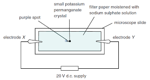
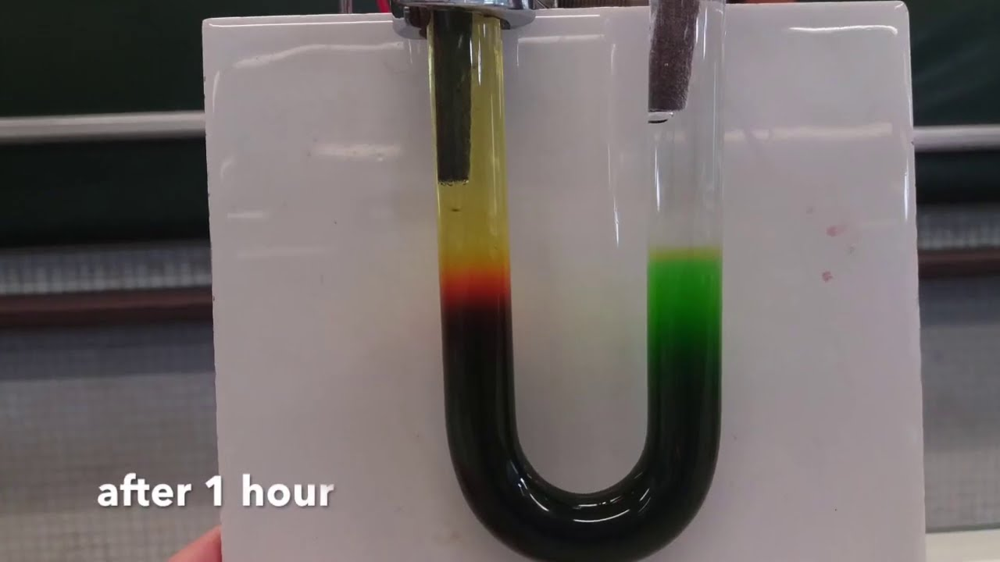

# Migration of ions

What doe the migration of ions under the influence of an electric field show?
- It shows that the particles in ionic compounds are charged.

## On filter paper

The following setup shows a potassium permanganate crystal on the filter paper moistened with sodium sulphate solution.

1. Describe and explain the observations.
	- A purple patch moves towards the positive electrode.
	- The purple permanganate anions in potassium permanganate will move towards the positive electrode.
2. What is the purpose of moistening the filter paper with sodium sulphate solution?
	- To provide mobile ions to conduct electricity.
3. Can the filter paper be moistened with copper (II) chromate solution instead?
	- No. The chromate ions in copper (II) chromate solution are green which would obstruct the colour movement being observed.
4. What would happen if the filter paper is moistened with tap water instead of sodium sulphate?
	- The movement of the colour patch becomes slower.
5. After some time, the poles were reversed but the colour stopped migrating. Why?
	- The filter paper has dried out. Without water, the ions on the filter paper cannot migrate and conduct electricity.

## In U-tube

The following setup shows copper (II) dichromate migration.

1. What is the tube filled with at the two ends?
	- Dilute hydrochloric acid
2. What is the use of the gel in the U-tube?
	- To slow down the mixing of the bottom layer of the U-tube with the top layer. We can have better observations of the colour changes during the migration of ions.